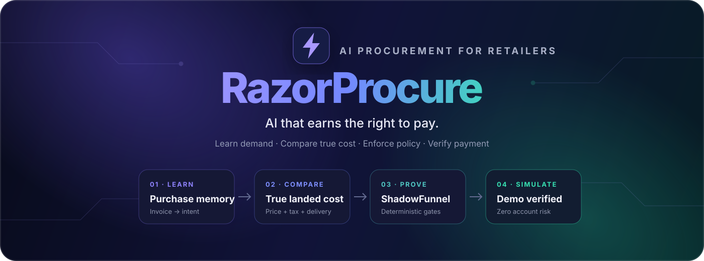
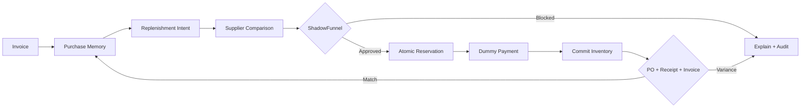
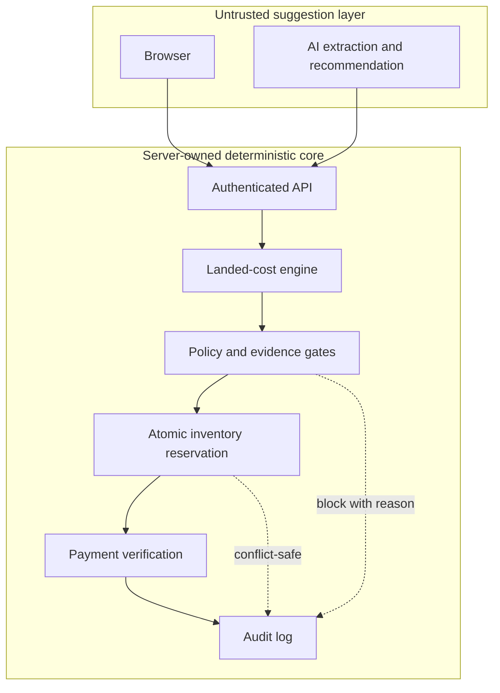

<p align="center">
  
</p>

<p align="center">
  <strong>AI procurement that learns demand, proves every decision, and pays only after deterministic safety checks.</strong>
</p>

<p align="center">
  <a href="https://razorpay-hackathon-phi.vercel.app/"></a>
</p>

<p align="center">
  <a href="#-five-minute-demo"></a>
  <a href="#-the-trust-model"></a>
  
  <a href="#-validation"></a>
  <a href="./LICENSE"></a>
</p>

<p align="center">
  <a href="#-quick-start">Quick start</a> ·
  <a href="https://razorpay-hackathon-phi.vercel.app/">Live application</a> ·
  <a href="#-five-minute-demo">Demo script</a> ·
  <a href="#-how-it-works">Architecture</a> ·
  <a href="./docs/API.md">Agent API</a> ·
  <a href="./SECURITY.md">Security</a>
</p>

---

<table>
  <tr>
    <td width="65%">
      <h3>🚀 Try it live</h3>
      <p>Explore the complete retailer workflow—from invoice memory to supplier comparison, policy gates, inventory races, savings replay, and audit.</p>
      <p><a href="https://razorpay-hackathon-phi.vercel.app/"><strong>Launch RazorProcure →</strong></a></p>
    </td>
    <td width="35%">
      <h3>🛡️ Zero account risk</h3>
      <p>The public deployment uses dummy payment data. It does not load Razorpay Checkout, call Razorpay APIs, or require a linked payment account.</p>
    </td>
  </tr>
</table>

## The idea

Small retailers repeat the same buying work every week: read invoices, remember what is running low, compare fragmented supplier quotes, check GST and delivery constraints, then make a payment they hope is correct.

**RazorProcure turns that manual loop into a safe, explainable procurement agent.** It converts invoices into purchase memory, predicts replenishment, ranks connected suppliers by true landed cost, enforces merchant policy and inventory atomically, and completes a risk-free simulated purchase only when every gate passes.

> **The AI may recommend. It may never authorize money.** Price, policy, stock, evidence, reservation, and payment verification remain server-owned and deterministic.

## ✨ What makes it different

| Capability | What the merchant sees | What the system proves |
|---|---|---|
| **Invoice intelligence** | One-click sample invoice or real image upload | Schema-validated extraction, checksum-bound demo, duplicate-safe import |
| **Purchase memory** | Recurring products and buying patterns | Durable SQLite history and deterministic normalization |
| **Smart Buy** | Best connected supplier and savings | Item price + tax + delivery, not a misleading sticker price |
| **Procurement Twin** | Stress-test the recommendation before paying | Price shock, outage, delay and demand-surge counterfactuals with a pre-cleared fallback |
| **ShadowFunnel** | A clear pass/block reason before checkout | Budget, GST, delivery, inventory, evidence, and spend gates |
| **Atomic inventory** | One request wins; overselling is blocked | Transactional reservation with race-safe state transitions |
| **Account-free payment demo** | One-click simulated purchase | Server-owned amount, deterministic completion, zero external account access |
| **Delivery discrepancy shield** | Exact receipt closes; overcharge or shortage is held | Server-authorized three-way PO/receipt/invoice match with protected value |
| **Replay proof** | Baseline vs guarded outcome | Reproducible paired runs across 50 purchase intents |
| **Audit trail** | Every decision in one place | Append-only events connecting intent, gate, order, payment, and outcome |

## 🔁 The procurement loop



## 🎬 Five-minute demo

Run `start.bat`, open the exact URL it prints, sign in, and follow this path:

| Time | Click | What to say |
|---:|---|---|
| **0:00** | **Home → Try demo invoice** | “RazorProcure turns an invoice into three structured line items without a network dependency. Repeating it is idempotent.” |
| **0:40** | **Purchase Memory** | “The agent now understands what this retailer buys—not just what is in one cart.” |
| **1:10** | **Smart Buy → Example 1 → Compare & optimize → Approve demo purchase** | “We compare connected suppliers using true landed cost, then expose every decision before a local dummy payment commits stock.” |
| **1:35** | **Stress-test this plan** | “The Procurement Twin simulates price shock, supplier outage, delivery slip and doubled demand, then pre-clears the best fallback inside policy.” |
| **1:55** | **Approve demo purchase → Test supplier discrepancy** | “A ₹250 invoice overcharge is held automatically because the PO, receipt and invoice do not match. The UI quantifies the value protected.” |
| **2:05** | **Smart Buy → Optimize 3-item basket** | “The optimizer allocates the complete basket across two suppliers and compares the result with the full usual-supplier basket.” |
| **2:25** | **Smart Buy → Open safety demo → Run full demo** | “ShadowFunnel deterministically checks policy, inventory, evidence, and spend. The LLM cannot bypass these gates.” |
| **3:00** | **Reset → Inventory race** | “One atomic claim wins; the loser is replanned and payment remains blocked until the revised mandate is approved.” |
| **3:35** | **Merchant Truth → Try demo certificate** | “Supplier evidence is checksum-bound and verified as current—not accepted on model confidence.” |
| **4:05** | **Savings Insights → Run paired replay** | “The same intents run through baseline and guarded paths, making the safety and savings claim reproducible.” |
| **4:40** | **Audit** | “Every recommendation, block, reservation, checkout, and outcome is explainable after the fact.” |

To show payment safely, use **Smart Buy → Example 1 → Compare & optimize → Approve demo purchase**. Then click **Test supplier discrepancy** to show the post-payment three-way match holding a dummy ₹250 overcharge. The server completes the dummy transaction, commits the reservation and writes both payment and receiving audit events without contacting an external provider.

## 🧠 The trust model



The **ShadowFunnel** kernel is the boundary between probabilistic suggestions and financial authority:

- The browser never decides the payable amount.
- Model output is treated as untrusted data and schema-validated.
- Supplier eligibility, GST, delivery, budget, evidence, and spend limits are recalculated server-side.
- Inventory is reserved transactionally before checkout and committed only after verified payment.
- A signed receipt authority binds receiving to the paid order; shortages and invoice variances are held before order closure.
- Public demo payments are completed internally with explicit `externalNetworkCall: false` audit evidence.
- External Razorpay Test Mode is fail-closed and available only through an intentional private `PAYMENT_MODE=razorpay_test` opt-in.
- Same-origin controls, signed sessions, rate limits, CSP, and redacted errors protect the application surface.

## 🏗️ How it works

| Layer | Responsibility |
|---|---|
| **Next.js App Router** | Merchant UI, server components, authenticated route handlers |
| **Procurement engine** | Normalization, deterministic landed cost, supplier ranking, policy evaluation |
| **ShadowFunnel** | Preflight gates, reservations, replay, evidence verification, audit events |
| **SQLite** | Local durable single-user state for sessions, inventory, purchases, orders, receipts, and audit |
| **Payment simulator** | Default account-free flow using dummy order/payment identifiers and no external network call |
| **Razorpay adapter** | Optional, private Test Mode integration; disabled by default and never accepts live-mode keys |
| **OpenRouter** | Optional extraction for merchant-uploaded invoices; never required for the bundled demo |

Important code and design notes live in [`docs/ARCHITECTURE.md`](./docs/ARCHITECTURE.md), [`docs/API.md`](./docs/API.md), and [`SECURITY.md`](./SECURITY.md).

## 🚀 Quick start

### Windows demo build

1. Install **Node.js 22+**.
2. Double-click **`configure.bat`** to create local authentication secrets and optionally add OpenRouter credentials.
3. Double-click **`start.bat`**. It installs pinned dependencies, builds production, stops only its previously recorded RazorProcure process, selects a free port from 3100–3199, and opens the exact URL.
4. Run **`show-login.bat`** to display the generated single-user credentials.
5. Use **`stop.bat`** when finished; it stops only RazorProcure.

### Terminal

```bash
npm ci
npm run bootstrap
npm run dev
```

For the same production-mode flow used by the Windows launcher:

```bash
npm run build
npm run start -- -p 3100
```

### Configuration

No credentials are committed. Local values belong in `.env.local`.

| Variable | Purpose | Required? |
|---|---|---|
| `AUTH_EMAIL` | Single local merchant identity | Generated locally |
| `AUTH_PASSWORD` | Single local merchant password | Generated locally |
| `AUTH_SECRET` | Signs authenticated sessions | Generated locally |
| `DATABASE_URL` | SQLite file location | Defaults to local `.data` storage |
| `POSTGRES_URL` | Supabase Postgres snapshot store for durable Vercel state | Required on Vercel |
| `PAYMENT_MODE` | `demo` uses account-free dummy payments | Defaults to `demo` |
| `OPENROUTER_API_KEY` | Real invoice extraction | Optional; demo invoice works offline |

To clear any existing local payment credentials and lock the app back to dummy-payment mode:

```bash
npm run payments:disconnect
```

## 🔌 Agent-ready API

External agents can inspect procurement opportunities without bypassing the safety kernel.

| Method | Endpoint | Purpose |
|---|---|---|
| `GET` | `/api/agent/capabilities` | Discover supported agent actions |
| `POST` | `/api/agent/opportunities` | Read deterministic savings opportunities |
| `POST` | `/api/agent/preflight` | Evaluate an intent through ShadowFunnel |
| `POST` | `/api/agent/execute` | Execute an eligible procurement workflow |

See the request/response contract in [`docs/API.md`](./docs/API.md).

## ✅ Validation

Run the complete release gate:

```bash
npm run verify
```

The current verified baseline is:

- TypeScript: clean
- ESLint: clean
- Vitest: **60/60 tests passing** across 17 test files
- Next.js production build: successful
- Dependency audit: **0 known vulnerabilities**
- Secret scan: clean

On Windows, `verify.bat` runs the same static release gate. With the app running, `npm run smoke` covers authenticated invoice import, full-basket optimization, Procurement Twin counterfactuals, both receiving outcomes, the flagship flow, dummy checkout, the inventory race with replan, replay and audit.

## ☁️ Deployment note

The repository is Vercel-build ready and includes `vercel.json`. On Vercel it restores and checkpoints a checksummed, versioned workspace snapshot through Supabase Postgres while retaining SQLite's local transactional engine. This is durable for the single-user deployment; a future multi-tenant release should move to row-native Postgres repositories.

See [`docs/VERCEL_DEPLOYMENT.md`](./docs/VERCEL_DEPLOYMENT.md) for the exact boundary.

## 📚 Documentation

- [`docs/ARCHITECTURE.md`](./docs/ARCHITECTURE.md) — system design and trust boundaries
- [`docs/COMPETITIVE_BENCHMARK.md`](./docs/COMPETITIVE_BENCHMARK.md) — official-product benchmark and honest differentiation
- [`docs/API.md`](./docs/API.md) — integration surface for external agents
- [`docs/DEMO_SCRIPT.md`](./docs/DEMO_SCRIPT.md) — extended presentation script
- [`docs/DATA_MODEL.md`](./docs/DATA_MODEL.md) — persisted entities and invariants
- [`docs/OPERATIONS.md`](./docs/OPERATIONS.md) — launch, recovery and payment modes
- [`docs/DEPLOYMENT.md`](./docs/DEPLOYMENT.md) — safe public deployment and production boundary
- [`docs/TEST_MATRIX.md`](./docs/TEST_MATRIX.md) — executable acceptance evidence
- [`SECURITY.md`](./SECURITY.md) — threat model and controls
- [`VALIDATION.md`](./VALIDATION.md) — release evidence and commands

---

<p align="center">
  <strong>RazorProcure</strong><br />
  Learn the purchase. Prove the decision. Protect the payment.
</p>

<p align="center">
  Built for the Razorpay Hackathon · MIT licensed
</p>
