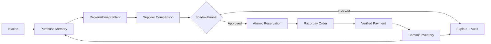
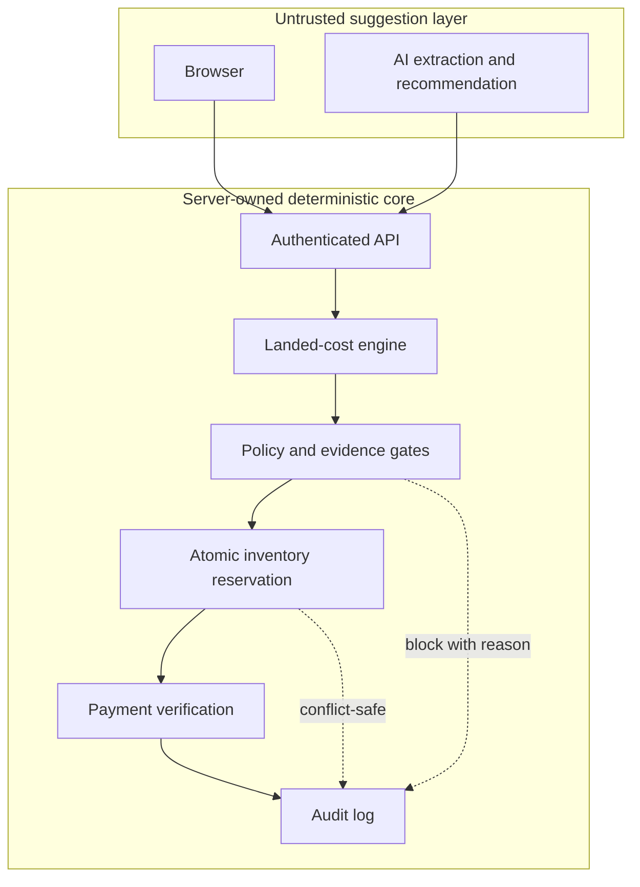

<p align="center">
  
</p>

<p align="center">
  <strong>AI procurement that learns demand, proves every decision, and pays only after deterministic safety checks.</strong>
</p>

<p align="center">
  <a href="#-five-minute-demo"></a>
  <a href="#-the-trust-model"></a>
  <a href="#-validation"></a>
  <a href="./LICENSE"></a>
</p>

<p align="center">
  <a href="#-quick-start">Quick start</a> ·
  <a href="#-five-minute-demo">Demo script</a> ·
  <a href="#-how-it-works">Architecture</a> ·
  <a href="./docs/API.md">Agent API</a> ·
  <a href="./SECURITY.md">Security</a>
</p>

---

## The idea

Small retailers repeat the same buying work every week: read invoices, remember what is running low, compare fragmented supplier quotes, check GST and delivery constraints, then make a payment they hope is correct.

**RazorProcure turns that manual loop into a safe, explainable procurement agent.** It converts invoices into purchase memory, predicts replenishment, ranks connected suppliers by true landed cost, enforces merchant policy and inventory atomically, and creates a Razorpay order only when every gate passes.

> **The AI may recommend. It may never authorize money.** Price, policy, stock, evidence, reservation, and payment verification remain server-owned and deterministic.

## ✨ What makes it different

| Capability | What the merchant sees | What the system proves |
|---|---|---|
| **Invoice intelligence** | One-click sample invoice or real image upload | Schema-validated extraction, checksum-bound demo, duplicate-safe import |
| **Purchase memory** | Recurring products and buying patterns | Durable SQLite history and deterministic normalization |
| **Smart Buy** | Best connected supplier and savings | Item price + tax + delivery, not a misleading sticker price |
| **ShadowFunnel** | A clear pass/block reason before checkout | Budget, GST, delivery, inventory, evidence, and spend gates |
| **Atomic inventory** | One request wins; overselling is blocked | Transactional reservation with race-safe state transitions |
| **Razorpay checkout** | Familiar Test Mode payment flow | Server-created order, HMAC signature, API status, amount and currency verification |
| **Replay proof** | Baseline vs guarded outcome | Reproducible paired runs across 50 purchase intents |
| **Audit trail** | Every decision in one place | Append-only events connecting intent, gate, order, payment, and outcome |

## 🔁 The procurement loop



## 🎬 Five-minute demo

Start at `http://localhost:3100`, sign in, and follow this exact path:

| Time | Click | What to say |
|---:|---|---|
| **0:00** | **Home → Try demo invoice** | “RazorProcure turns an invoice into three structured line items without a network dependency. Repeating it is idempotent.” |
| **0:40** | **Purchase Memory** | “The agent now understands what this retailer buys—not just what is in one cart.” |
| **1:10** | **Smart Buy → Example 1 → Compare & optimize** | “We compare connected suppliers using true landed cost, then expose every decision before money moves.” |
| **2:00** | **Safety Demo → Check request → Run full demo** | “ShadowFunnel deterministically checks policy, inventory, evidence, and spend. The LLM cannot bypass these gates.” |
| **2:50** | **Safety Demo → Reset → Inventory race** | “Two buyers compete for the last stock. Exactly one reserves it; the other is safely blocked.” |
| **3:30** | **Safety Demo → Merchant Truth → Try demo certificate** | “Supplier evidence is checksum-bound and verified as current—not accepted on model confidence.” |
| **4:05** | **Savings Insights → Run paired replay** | “The same 50 intents run through baseline and guarded paths, making the safety and savings claim reproducible.” |
| **4:40** | **Audit** | “Every recommendation, block, reservation, checkout, and outcome is explainable after the fact.” |

If you want to show payment, return to **Safety Demo**, run the full demo, and continue into **Razorpay Test Mode**. No real money is charged.

## 🧠 The trust model



The **ShadowFunnel** kernel is the boundary between probabilistic suggestions and financial authority:

- The browser never decides the payable amount.
- Model output is treated as untrusted data and schema-validated.
- Supplier eligibility, GST, delivery, budget, evidence, and spend limits are recalculated server-side.
- Inventory is reserved transactionally before checkout and committed only after verified payment.
- Checkout verification checks the Razorpay signature **and** fetches authoritative order/payment state.
- Same-origin controls, signed sessions, rate limits, CSP, and redacted errors protect the application surface.

## 🏗️ How it works

| Layer | Responsibility |
|---|---|
| **Next.js App Router** | Merchant UI, server components, authenticated route handlers |
| **Procurement engine** | Normalization, deterministic landed cost, supplier ranking, policy evaluation |
| **ShadowFunnel** | Preflight gates, reservations, replay, evidence verification, audit events |
| **SQLite** | Local durable single-user state for sessions, inventory, purchases, orders, and audit |
| **Razorpay** | Test Mode order creation and cryptographic checkout verification |
| **OpenRouter** | Optional extraction for merchant-uploaded invoices; never required for the bundled demo |

Important code and design notes live in [`docs/ARCHITECTURE.md`](./docs/ARCHITECTURE.md), [`docs/API.md`](./docs/API.md), and [`SECURITY.md`](./SECURITY.md).

## 🚀 Quick start

### Windows demo build

1. Install **Node.js 22+**.
2. Double-click **`configure.bat`** to create local secrets and optionally add Razorpay/OpenRouter credentials.
3. Double-click **`start.bat`**. It installs pinned dependencies, builds production, stops conflicting RazorProcure processes, and opens `http://localhost:3100`.
4. Run **`show-login.bat`** to display the generated single-user credentials.
5. Use **`stop.bat`** when finished; it stops only RazorProcure.

### Terminal

```bash
npm ci
npm run bootstrap
npm run dev
```

For the same production-mode flow used by the Windows launcher:

```bash
npm run build
npm run start -- -p 3100
```

### Configuration

No credentials are committed. Local values belong in `.env.local`.

| Variable | Purpose | Required? |
|---|---|---|
| `AUTH_EMAIL` | Single local merchant identity | Generated locally |
| `AUTH_PASSWORD` | Single local merchant password | Generated locally |
| `AUTH_SECRET` | Signs authenticated sessions | Generated locally |
| `DATABASE_URL` | SQLite file location | Defaults to local `.data` storage |
| `RAZORPAY_KEY_ID` | Razorpay Test Mode public key | Only for checkout |
| `RAZORPAY_KEY_SECRET` | Razorpay Test Mode secret | Only for checkout |
| `OPENROUTER_API_KEY` | Real invoice extraction | Optional; demo invoice works offline |

## 🔌 Agent-ready API

External agents can inspect procurement opportunities without bypassing the safety kernel.

| Method | Endpoint | Purpose |
|---|---|---|
| `GET` | `/api/agent/capabilities` | Discover supported agent actions |
| `POST` | `/api/agent/opportunities` | Read deterministic savings opportunities |
| `POST` | `/api/agent/preflight` | Evaluate an intent through ShadowFunnel |
| `POST` | `/api/agent/execute` | Execute an eligible procurement workflow |

See the request/response contract in [`docs/API.md`](./docs/API.md).

## ✅ Validation

Run the complete release gate:

```bash
npm run verify
```

The current verified baseline is:

- TypeScript: clean
- ESLint: clean
- Vitest: **40/40 tests passing** across 13 test files
- Next.js production build: successful
- Dependency audit: **0 known vulnerabilities**
- Secret scan: clean

On Windows, `verify.bat` runs the same sequence. Runtime smoke checks also cover preflight, the complete flagship flow, the inventory race, replay, evidence verification, invoice idempotency, agent endpoints, and cross-origin protection.

## ☁️ Deployment note

The repository is Vercel-build ready and includes `vercel.json`. Its Vercel demo mode stores SQLite in ephemeral `/tmp`, which is appropriate for a disposable hackathon demo—not durable production data. Before a public production launch, replace the local database adapter with a managed store such as Postgres/Neon or Turso and rotate all deployment credentials.

See [`docs/VERCEL_DEPLOYMENT.md`](./docs/VERCEL_DEPLOYMENT.md) for the exact boundary.

## 📚 Documentation

- [`docs/ARCHITECTURE.md`](./docs/ARCHITECTURE.md) — system design and trust boundaries
- [`docs/API.md`](./docs/API.md) — integration surface for external agents
- [`docs/DEMO_SCRIPT.md`](./docs/DEMO_SCRIPT.md) — extended presentation script
- [`SECURITY.md`](./SECURITY.md) — threat model and controls
- [`VALIDATION.md`](./VALIDATION.md) — release evidence and commands

---

<p align="center">
  <strong>RazorProcure</strong><br />
  Learn the purchase. Prove the decision. Protect the payment.
</p>

<p align="center">
  Built for the Razorpay Hackathon · MIT licensed
</p>
